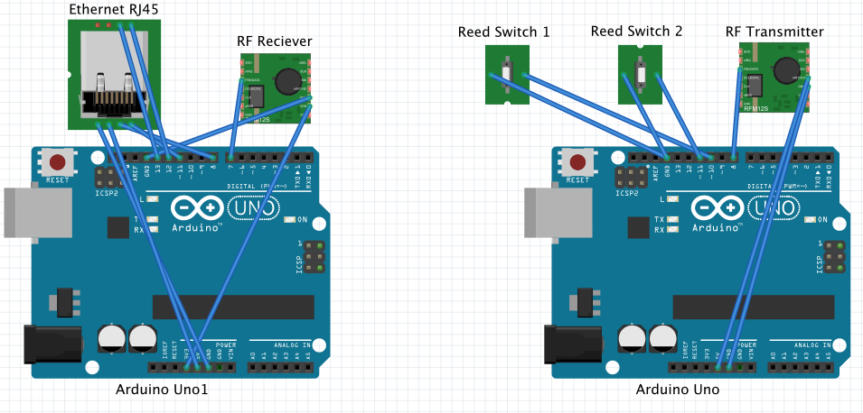

# Enttoi Arduino client

The client that built from two Arduino boards:
* First one installed in cabin itself and has sensors connected to it. This board
sends state of sensor via RF transmitter to the second board. This one also called `client`.
* Second one installed in place where LAN socket is available. RF receiver receives signals from the first board
and forwards it to the [gateway](https://github.com/Enttoi/enttoi-gateway) via LAN. This one also called `server`.

This solves an issue with unreliable WiFi connections or lack of such in cabins.

## Board schematic

The following parts required:
* Two Arduino boards
* RF Receiver/Transmitter module
* LAN connector
* 2 [reed switches](http://www.aliexpress.com/item//32424305003.html)
* LCD Screen (optional)
* Two 5V USB power adapters
* Wires

All parts should be connected in the following way:

## Application Configurations

Before deploying the following needs to be configured in code itself:

* On `./server/Toil8Server.ino` file find all places where `Authorization: xxx` appears. Replace `xxx` with your 
authorization key.

## Deployment

* Deploy `./server/Toil8Server.ino` to `server` board
* Deploy `./client/Toil8Client.ino` to `client` board
